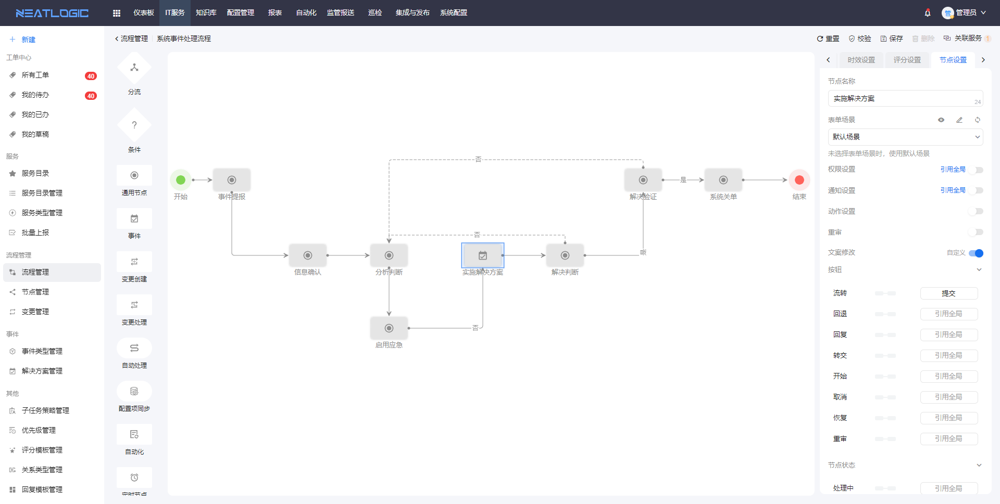
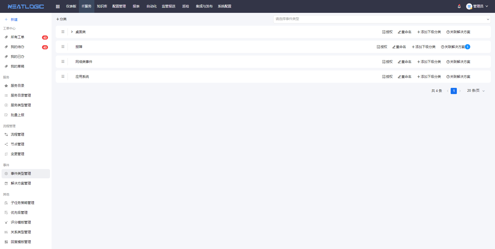
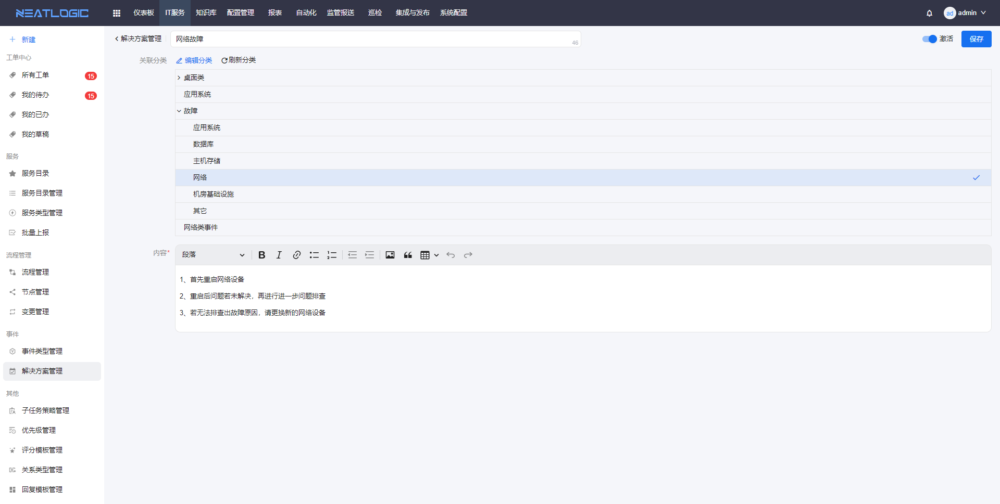
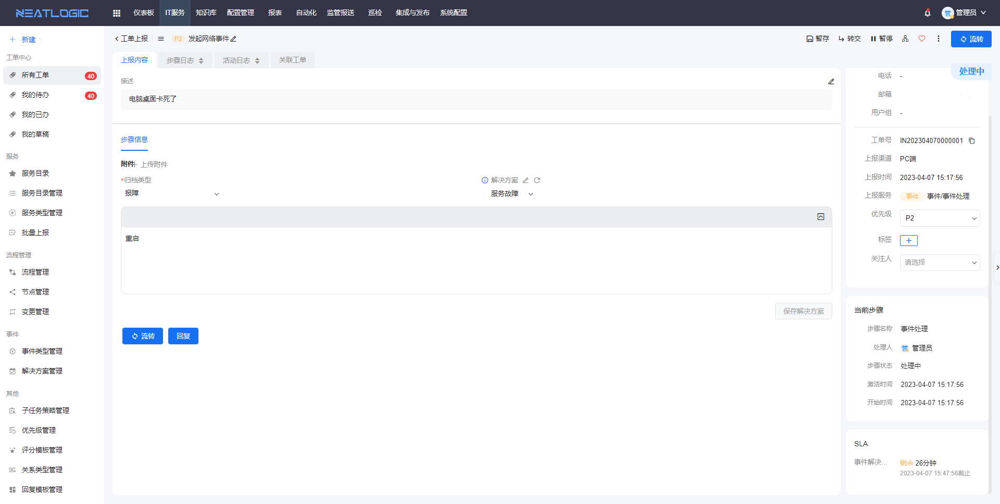

中文 / [English](README.en.md)

    

---

## 关于

neatlogic-event是事件管理模块，用于对事件的精细化管理，用于发起事件类工单，包含事件节点、事件类型管理、解决方案管理和事件处理等功能。

## 主要功能

### 事件节点

在流程管理中配置包含事件节点的流程 

- 支持通知功能
- 支持关联优先级的时效策略
- 支持指定处理人，或者配置分派器规则，如按分组成员工作量分配处理人

### 事件类型管理

事件类型是指事件归档的类型，事件类型还可以关联事件解决方案，事件类型有授权操作，授权的用户才能使用对应事件类型。

### 解决方案管理

解决方案管理是将常见的事件的解决方案保存为模板，在事件处理过程中提供回复模板。

- 解决方案支持关联多个事件类型

### 事件处理

在事件处理时，必须填写事件类型和解决方案，解决方案支持引用现成模板或者自定义。

- 事件处理步骤支持暂停
- 在事件处理的过程中，支持添加新的解决方案。